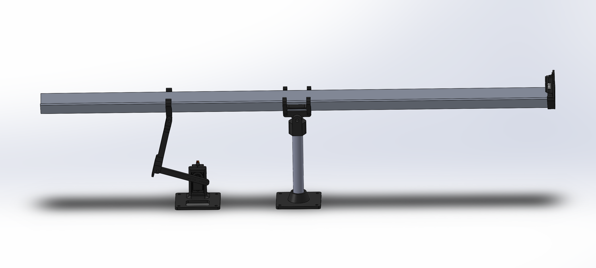
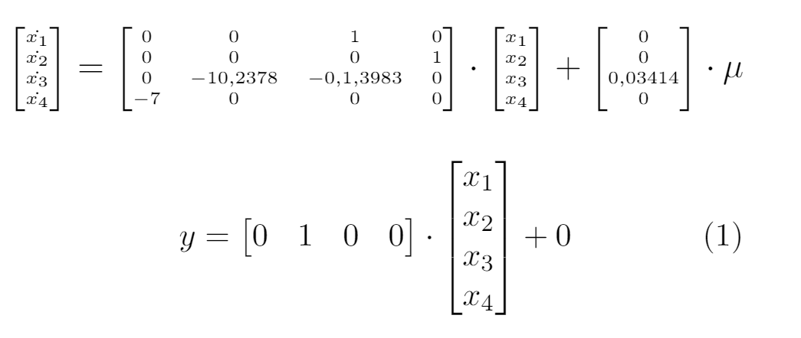
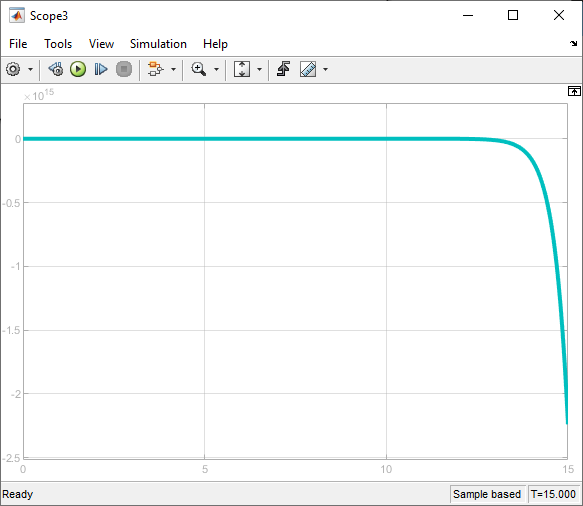

# **Ball and Beam (Matlab R2020a)**

**Integrantes:**  
Jaime Alejandro Condori Machaca  
Sergio Rodrigo Fernández Testa

**Docente:**  
Ing. Alexis Andrade

## Modelo 3D

## **Espacio de estados**

## **Sistema en open-loop**

## **Controladores implementados**

1. Pole placement
2. Itae

## **Parámetros**

### **Pole placement**

~~~matlab
OS = 4%
ts = 0.7[s]
~~~

### **ITAE**

~~~matlab
Wn = 7
~~~

> También se implemento el controlaor LQR, pero no se incluyó en el reporte, sus ganacias fueron:

~~~matlab
Q =  [100 0 0 0; 
        0 1 0 0;
        0 0 1 0;
        0 0 0 1];

Qext =[100 0 0 0 0; 
         0 1 0 0 0;
         0 0 1 0 0;
         0 0 0 1 0;
         0 0 0 0 2];

R = 0.0001;
~~~